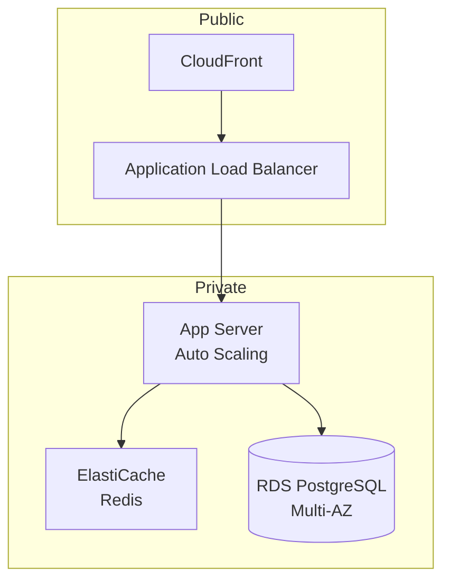

# Phase: Architecture Detail

詳細アーキテクチャ設計フェーズ。
Wave A で決定した高レベルアーキテクチャに基づき、
セキュリティ設計、インフラ構成、キャッシュ戦略を詳細化する。

## Contract (YAML)

```yaml
phase_id: "3b"
required_artifacts:
  - docs/03_architecture/architecture.md
  - docs/03_architecture/adr.md
  - decisions.architecture   # Blackboard: NFR ポリシー
  - decisions.entities       # Blackboard: データ構造（Wave A）

outputs:
  - path: docs/03_architecture/security.md
    required: true
  - path: docs/03_architecture/infrastructure.md
    required: true
  - path: docs/03_architecture/cache_strategy.md
    required: true

contract_outputs:
  - key: decisions.architecture.security
    type: object
    description: "セキュリティ設計（認証実装詳細、脆弱性対策、データガバナンス）"
  - key: decisions.architecture.cache
    type: object
    description: "キャッシュ戦略（レイヤー別 TTL、キー設計、無効化戦略）"
  - key: decisions.architecture.infrastructure
    type: object
    description: "インフラ構成（可用性目標、構成要素、スケーリング方針）"

quality_gates:
  - "Wave A の NFR ポリシーが全てセキュリティ/インフラ設計に反映されていること"
  - "OWASP Top 10 の脅威が全て対策テーブルに含まれていること"
  - "PII 分類と保持期限が定義されていること"
  - "RTO/RPO が明示されていること"
  - "キャッシュ戦略が全レイヤーで定義されていること"
```

## 入力要件

| 入力 | 必須 | 説明 |
|------|------|------|
| docs/03_architecture/architecture.md | ○ | Wave A の出力（高レベルアーキテクチャ） |
| docs/03_architecture/adr.md | ○ | 技術選定記録 |
| decisions.architecture（Blackboard） | ○ | NFR ポリシー（認証方式、エラー形式等） |
| decisions.entities（Blackboard） | ○ | データ構造（Wave A） |

## 出力ファイル

| ファイル | 説明 |
|---------|------|
| docs/03_architecture/security.md | セキュリティ設計 |
| docs/03_architecture/infrastructure.md | インフラ構成 |
| docs/03_architecture/cache_strategy.md | キャッシュ戦略 |

### security.md 必須セクション

1. 認証実装詳細（JWT 署名方式、トークン保存、セッション管理）
2. 脆弱性対策（OWASP Top 10 対応テーブル）
3. データガバナンス（データ分類、PII 対応、ライフサイクル）
4. PII マスキングルール

### infrastructure.md 必須セクション

1. 可用性目標（稼働率、RTO、RPO）
2. 構成図（Mermaid 形式）
3. スケーリング方針
4. ネットワーク構成（パブリック/プライベート分離）

### cache_strategy.md 必須セクション

1. レイヤー別設計（ブラウザ、CDN、アプリケーション、DB）
2. キャッシュキー設計
3. 無効化戦略
4. TTL 設計

## ワークフロー

```
1. Blackboard から NFR ポリシーを読み込み
2. architecture.md / adr.md から技術選定を確認
3. entities からデータ構造を把握
4. セキュリティ設計を詳細化
   4a. Wave A で決定した認証方式に基づく実装詳細
   4b. 脆弱性対策テーブル（OWASP Top 10）
   4c. データガバナンス（PII 分類、保持期限、マスキングルール）
5. キャッシュ戦略を設計
   5a. レイヤー別キャッシュ設計
   5b. キャッシュキー命名規則
   5c. 無効化戦略
6. インフラ構成を設計
   6a. 可用性目標（稼働率、RTO、RPO）
   6b. 構成図（Mermaid）
   6c. スケーリング方針
7. 各ファイルを生成
8. contract_outputs を出力
```

## セキュリティ設計

### 認証実装詳細

Wave A で決定した認証方式に基づき、詳細を設計:

| 項目 | 設計内容 |
|------|---------|
| JWT 署名 | RS256、公開鍵は JWKS エンドポイント |
| トークン保存 | Access: メモリ、Refresh: httpOnly Cookie |
| セッション管理 | Redis（TTL 付き） |
| CSRF 対策 | SameSite=Strict + Double Submit Cookie |

### 脆弱性対策

| 脅威 | 対策 | 検証方法 |
|------|------|---------|
| XSS | CSP、サニタイズ | OWASP ZAP |
| CSRF | SameSite Cookie、Token | 手動テスト |
| SQL Injection | パラメータ化クエリ | 静的解析 |
| SSRF | 許可リスト、プライベートIP拒否 | 手動テスト |

## データガバナンス（security.md に含める）

### データ分類と取り扱い

| 分類 | 例 | 保存要件 | アクセス要件 |
|------|-----|---------|------------|
| PII | 氏名、メール、住所 | 暗号化必須、保持期限設定 | 認証+認可+監査ログ |
| Sensitive | 決済情報、医療情報 | 暗号化必須、厳格なアクセス制御 | 最小権限原則+MFA |
| Internal | ユーザーID、タイムスタンプ | 標準暗号化 | 認証必須 |
| Public | カテゴリ名、公開コンテンツ | なし | 制限なし |

### データライフサイクル

| 項目 | 定義内容 |
|------|---------|
| 保持期限 | データ種別ごとの保持期間（法的要件考慮） |
| 削除ポリシー | 物理削除 / 論理削除 / 匿名化 |
| 匿名化ルール | PII フィールドのマスキング・ハッシュ化方式 |
| 監査ログ | アクセスログの保持期間、記録項目 |

### PII マスキングルール

| 対象 | マスキング方式 | 例 |
|------|--------------|-----|
| メールアドレス | 部分マスク | t***@example.com |
| 電話番号 | 後方マスク | 090-****-**** |
| 氏名 | 仮名化 | User_12345 |

## キャッシュ戦略設計

### レイヤー別設計

| レイヤー | 技術 | TTL | 無効化戦略 |
|---------|------|-----|-----------|
| ブラウザ | Cache-Control | 1日 | ETag |
| CDN | CloudFront | 1時間 | パスベース無効化 |
| アプリケーション | Redis | 15分 | イベント駆動 |
| DB | クエリキャッシュ | 5分 | 更新時クリア |

### キャッシュキー設計

```
// ユーザー固有データ
cache:user:{userId}:profile
cache:user:{userId}:settings

// 共有データ
cache:global:categories
cache:global:config
```

## インフラ設計

### 可用性目標

| 項目 | 目標 |
|------|------|
| 稼働率 | 99.9%（8.76時間/年ダウンタイム許容） |
| RTO | 1時間 |
| RPO | 5分 |

### 構成図（Mermaid）



## エラーハンドリング

| エラー | 対応 |
|--------|------|
| NFR ポリシー不在 | P0 報告、architecture-skeleton への差し戻し |
| 技術選定記録（ADR）不在 | P0 報告、architecture-skeleton の実行を要請 |
| エンティティ不在 | P1 報告、database フェーズの完了を要請 |
| セキュリティ要件不明確 | P2 報告、デフォルト推奨値で設計しつつ入力要請 |
