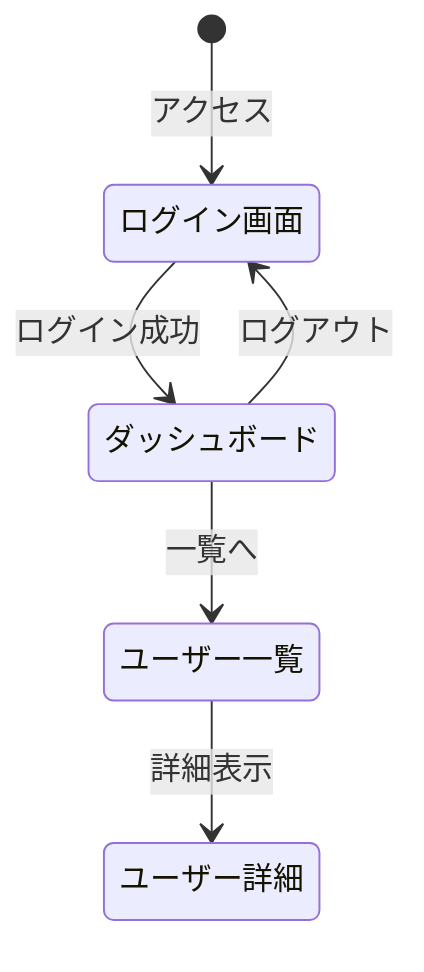

# Phase: Design Inventory

画面棚卸しフェーズ。
ユーザーストーリーから画面を抽出し、画面一覧と画面遷移図を作成する。

## Contract (YAML)

```yaml
phase_id: "6a"
required_artifacts:
  - docs/requirements/user-stories.md
  - docs/requirements/story_map.md         # optional

outputs:
  - path: docs/06_screen_design/screen_list.md
    required: true
  - path: docs/06_screen_design/screen_transition.md
    required: true

contract_outputs:
  - key: decisions.screens
    type: array
    description: "画面一覧（id, name, category, url, fr_refs）"
  - key: traceability.fr_to_sc
    type: object
    description: "FR-ID → SC-ID[] のマッピング"

quality_gates:
  - "全 FR-ID が最低1つの画面にマッピングされていること"
  - "全画面に SC-ID が付与されていること"
  - "画面遷移図が Mermaid stateDiagram-v2 で定義されていること"
  - "認証が必要なプロジェクトでは認証関連画面（ログイン等）が含まれること"
```

## 入力要件

| 入力 | 必須 | 説明 |
|------|------|------|
| docs/requirements/user-stories.md | ○ | 画面抽出元（Gherkin 形式） |
| docs/requirements/story_map.md | △ | Epic/Feature/Story 階層 |

## 出力ファイル

| ファイル | 説明 |
|---------|------|
| docs/06_screen_design/screen_list.md | 画面一覧 |
| docs/06_screen_design/screen_transition.md | 画面遷移図 |

### screen_list.md 必須セクション

1. 画面一覧テーブル（SC-ID, 名称, カテゴリ, URL, 対応 FR）
2. 画面カテゴリ定義
3. 暗黙的に必要な画面の洗い出し

### screen_transition.md 必須セクション

1. 画面遷移図（Mermaid stateDiagram-v2）
2. 遷移条件の説明

## ワークフロー

```
1. user-stories.md を読み込み
2. ユーザーストーリーから画面を抽出
3. 暗黙的に必要な画面を追加
4. 画面をカテゴリ分類
5. 各画面に SC-ID を採番
6. 画面一覧を生成
7. 画面遷移図を生成（Mermaid stateDiagram-v2）
8. FR → SC トレーサビリティを記録
9. contract_outputs を出力
```

## 画面抽出ルール

### ユーザーストーリーからの抽出

| ストーリー要素 | 画面候補 |
|--------------|---------|
| "〜を確認したい" | 一覧画面 / 詳細画面 |
| "〜を登録したい" | 入力フォーム画面 |
| "〜を編集したい" | 編集フォーム画面 |
| "〜を削除したい" | 確認モーダル |
| "〜を検索したい" | 検索画面 / フィルター付き一覧 |
| "〜にログインしたい" | ログイン画面 |

### 暗黙的に必要な画面

| 画面 | 条件 | SC-ID 範囲 |
|------|------|-----------|
| ログイン | 認証あり | SC-001〜010 |
| 新規登録 | ユーザー登録あり | SC-011〜020 |
| パスワードリセット | 認証あり | SC-021〜030 |
| エラーページ | 全プロジェクト | SC-900〜999 |

## 画面カテゴリ

| カテゴリ | 説明 | URL プレフィックス |
|---------|------|------------------|
| Public | 認証不要 | / |
| Auth | 認証関連 | /auth |
| Member | 要認証 | /app |
| Admin | 管理者用 | /admin |
| System | システム | /system |

## ID 採番ルール

| 項目 | ルール |
|------|--------|
| 形式 | SC-XXX（3桁ゼロパディング） |
| 開始 | 001 |
| 予約範囲 | 900-999（システム画面用） |

**ID プレアロケーション**（並列実行時の衝突防止）:

```yaml
# Blackboard の id_registry で管理
id_registry:
  sc:
    next: 1
    allocated: []
    reserved_ranges:
      - start: 900
        end: 999
        purpose: system_screens
```

## 画面遷移図テンプレート（Mermaid）



## エラーハンドリング

| エラー | 対応 |
|--------|------|
| 要件不明確 | P2 報告、仮の画面構成で進行 |
| FR 対応漏れ | P1 報告、該当 FR を open_questions に記録 |
| ID 衝突 | Blackboard の id_registry を確認して再採番 |
| 要件不在（FR が見つからない） | P0 報告、web-requirements への差し戻しを要請 |
