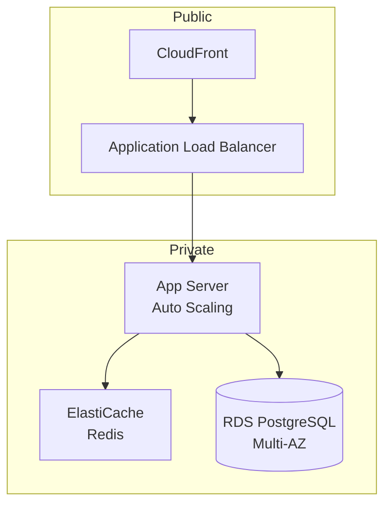

# Architecture Detail Skill

Wave B で実行される詳細アーキテクチャ設計スキル。
セキュリティ設計、インフラ構成、キャッシュ戦略を定義する。

**実行タイミング**: Wave B（api と並列）

## 前提条件

| 条件 | 必須 | 説明 |
|------|------|------|
| docs/03_architecture/architecture.md | ○ | Wave A の出力 |
| docs/03_architecture/adr.md | ○ | 技術選定記録 |
| Blackboard（decisions.architecture） | ○ | NFR ポリシー |
| Blackboard（decisions.entities） | ○ | データ構造（Wave A） |

## 出力ファイル

| ファイル | 説明 |
|---------|------|
| docs/03_architecture/security.md | セキュリティ設計 |
| docs/03_architecture/infrastructure.md | インフラ構成 |
| docs/03_architecture/cache_strategy.md | キャッシュ戦略 |

## 依存関係

| 種別 | 対象 |
|------|------|
| 前提スキル | architecture-skeleton（Wave A） |
| 並列スキル | api（Wave B） |
| 後続スキル | design-detail, implementation |

## ワークフロー

```
1. Blackboard から NFR ポリシーを読み込み
2. API 設計を読み込み
3. セキュリティ設計を詳細化
4. キャッシュ戦略を設計
5. インフラ構成を設計
6. 各ファイルを生成
7. SendMessage で contract_outputs を Lead に送信
```

## セキュリティ設計

### 認証実装詳細

Wave A で決定した認証方式に基づき、詳細を設計:

| 項目 | 設計内容 |
|------|---------|
| JWT 署名 | RS256、公開鍵は JWKS エンドポイント |
| トークン保存 | Access: メモリ、Refresh: httpOnly Cookie |
| セッション管理 | Redis（TTL 付き） |
| CSRF 対策 | SameSite=Strict + Double Submit Cookie |

### 脆弱性対策

| 脅威 | 対策 | 検証方法 |
|------|------|---------|
| XSS | CSP、サニタイズ | OWASP ZAP |
| CSRF | SameSite Cookie、Token | 手動テスト |
| SQL Injection | パラメータ化クエリ（Prisma） | 静的解析 |
| SSRF | 許可リスト、プライベートIP拒否 | 手動テスト |

## データガバナンス（security.md に含める）

### データ分類と取り扱い

| 分類 | 例 | 保存要件 | アクセス要件 |
|------|-----|---------|------------|
| PII | 氏名、メール、住所 | 暗号化必須、保持期限設定 | 認証+認可+監査ログ |
| Sensitive | 決済情報、医療情報 | 暗号化必須、厳格なアクセス制御 | 最小権限原則+MFA |
| Internal | ユーザーID、タイムスタンプ | 標準暗号化 | 認証必須 |
| Public | カテゴリ名、公開コンテンツ | なし | 制限なし |

### データライフサイクル

| 項目 | 定義内容 |
|------|---------|
| 保持期限 | データ種別ごとの保持期間（法的要件考慮） |
| 削除ポリシー | 物理削除 / 論理削除 / 匿名化 |
| 匿名化ルール | PII フィールドのマスキング・ハッシュ化方式 |
| 監査ログ | アクセスログの保持期間、記録項目 |

### PII マスキングルール

| 対象 | マスキング方式 | 例 |
|------|--------------|-----|
| メールアドレス | 部分マスク | t***@example.com |
| 電話番号 | 後方マスク | 090-****-**** |
| 氏名 | 仮名化 | User_12345 |

## キャッシュ戦略設計

### レイヤー別設計

| レイヤー | 技術 | TTL | 無効化戦略 |
|---------|------|-----|-----------|
| ブラウザ | Cache-Control | 1日 | ETag |
| CDN | CloudFront | 1時間 | パスベース無効化 |
| アプリケーション | Redis | 15分 | イベント駆動 |
| DB | クエリキャッシュ | 5分 | 更新時クリア |

### キャッシュキー設計

```
// ユーザー固有データ
cache:user:{userId}:profile
cache:user:{userId}:settings

// 共有データ
cache:global:categories
cache:global:config
```

## インフラ設計

### 可用性目標

| 項目 | 目標 |
|------|------|
| 稼働率 | 99.9%（8.76時間/年ダウンタイム許容） |
| RTO | 1時間 |
| RPO | 5分 |

### 構成図（Mermaid）



## SendMessage 完了報告

タスク完了時に以下の YAML 形式で Lead に SendMessage を送信する:

```yaml
status: ok
severity: null
artifacts:
  - docs/03_architecture/security.md
  - docs/03_architecture/infrastructure.md
  - docs/03_architecture/cache_strategy.md
contract_outputs:
  - key: decisions.architecture.security
    value: {認証/認可/脆弱性対策}
  - key: decisions.architecture.cache
    value: {キャッシュ戦略}
  - key: decisions.architecture.infrastructure
    value: {インフラ構成}
open_questions: []
blockers: []
```

**注意**: project-context.yaml には直接書き込まない（Aggregator の責務）。

## エラーハンドリング

| エラー | 対応 |
|--------|------|
| NFR ポリシー不在 | architecture-skeleton へ差し戻し（P1） |
| API 設計不整合 | api へ差し戻し（P1） |
| セキュリティ要件不明確 | P2 報告、デフォルト推奨値で設計 |
