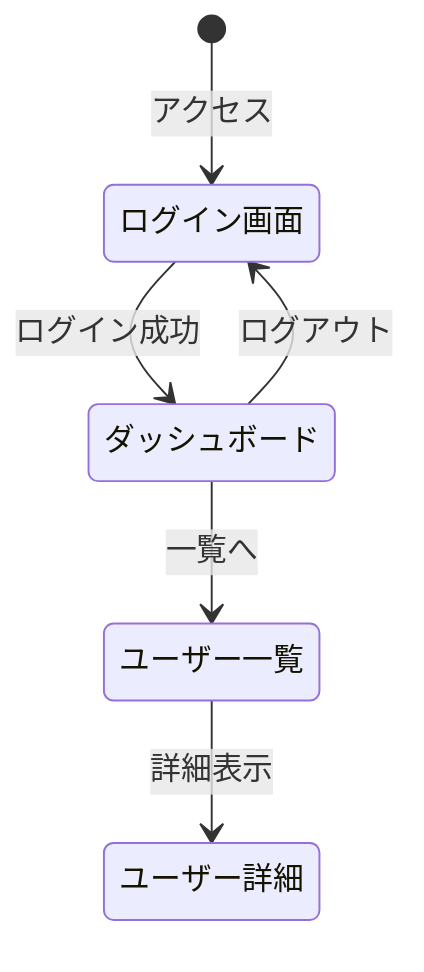

# Design Inventory Skill

Wave A で実行される画面棚卸しスキル。
画面一覧と遷移図を作成する（要件のみ依存、API 不要）。

**実行タイミング**: Wave A（architecture-skeleton, database と並列）

## 前提条件

| 条件 | 必須 | 説明 |
|------|------|------|
| docs/requirements/user-stories.md | ○ | 画面抽出元 |
| docs/requirements/story_map.md | △ | Epic/Feature/Story 階層 |

## 出力ファイル

| ファイル | 説明 |
|---------|------|
| docs/06_screen_design/screen_list.md | 画面一覧 |
| docs/06_screen_design/screen_transition.md | 画面遷移図 |

## 依存関係

| 種別 | 対象 |
|------|------|
| 前提スキル | web-requirements |
| 並列スキル | architecture-skeleton, database（Wave A） |
| 後続スキル | design-detail（Wave B 後） |

## Wave A 契約出力

Blackboard に以下を登録する:

```yaml
contract_outputs:
  - key: decisions.screens
    value:
      - id: SC-001
        name: ログイン画面
        category: Auth
        url: /login
        fr_refs: [FR-001]
      - id: SC-002
        name: ダッシュボード
        category: Member
        url: /dashboard
        fr_refs: [FR-002, FR-003]
      # ...
  - key: traceability.fr_to_sc
    value:
      FR-001: [SC-001, SC-002]
      FR-002: [SC-002]
      # ...
```

## ワークフロー

```
1. user-stories.md を読み込み
2. ユーザーストーリーから画面を抽出
3. 画面をカテゴリ分類
4. 各画面に SC-ID を採番
5. 画面一覧を生成
6. 画面遷移図を生成（Mermaid）
7. FR → SC トレーサビリティを記録
8. SendMessage で contract_outputs を Lead に送信
```

## 画面抽出ルール

### ユーザーストーリーからの抽出

| ストーリー要素 | 画面候補 |
|--------------|---------|
| "〜を確認したい" | 一覧画面 / 詳細画面 |
| "〜を登録したい" | 入力フォーム画面 |
| "〜を編集したい" | 編集フォーム画面 |
| "〜を削除したい" | 確認モーダル |
| "〜を検索したい" | 検索画面 / フィルター付き一覧 |
| "〜にログインしたい" | ログイン画面 |

### 暗黙的に必要な画面

| 画面 | 条件 | SC-ID 範囲 |
|------|------|-----------|
| ログイン | 認証あり | SC-001〜010 |
| 新規登録 | ユーザー登録あり | SC-011〜020 |
| パスワードリセット | 認証あり | SC-021〜030 |
| エラーページ | 全プロジェクト | SC-900〜999 |

## 画面カテゴリ

| カテゴリ | 説明 | URL プレフィックス |
|---------|------|------------------|
| Public | 認証不要 | / |
| Auth | 認証関連 | /auth |
| Member | 要認証 | /app |
| Admin | 管理者用 | /admin |
| System | システム | /system |

## ID 採番ルール

| 項目 | ルール |
|------|--------|
| 形式 | SC-XXX（3桁ゼロパディング） |
| 開始 | 001 |
| 予約範囲 | 900-999（システム画面用） |

**ID プレアロケーション**（並列実行時の衝突防止）:
```yaml
# project-context.yaml の id_registry で管理
id_registry:
  sc:
    next: 1
    allocated: []
    reserved_ranges:
      - start: 900
        end: 999
        purpose: system_screens
```

## 画面遷移図（Mermaid）



## SendMessage 完了報告

タスク完了時に以下の YAML 形式で Lead に SendMessage を送信する:

```yaml
status: ok
severity: null
artifacts:
  - docs/06_screen_design/screen_list.md
  - docs/06_screen_design/screen_transition.md
contract_outputs:
  - key: decisions.screens
    value:
      - id: SC-001
        name: ログイン画面
        category: Auth
        url: /login
        fr_refs: [FR-001]
      # 全画面を列挙
  - key: traceability.fr_to_sc
    value:
      FR-001: [SC-001, SC-002]
open_questions:
  - "画面詳細は Post-B で design-detail が実施"
blockers: []
```

**注意**: project-context.yaml には直接書き込まない（Aggregator の責務）。

## エラーハンドリング

| エラー | 対応 |
|--------|------|
| 要件不明確 | P2 報告、仮の画面構成で進行 |
| FR 対応漏れ | P1 報告、該当 FR を open_questions に記録 |
| ID 衝突 | project-context.yaml の id_registry を確認 |
