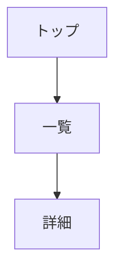

# Design Skill

画面設計を行うスキル。
UIレイアウト設計、ワイヤーフレーム作成、画面フロー定義、
ユーザーインターフェース仕様の文書化に使用する。

## 前提条件

| 条件 | 必須 | 説明 |
|------|------|------|
| docs/02_requirements/functional_requirements.md | ○ | 画面抽出元 |
| docs/03_architecture/architecture.md | ○ | エラーハンドリング設計参照 |
| docs/05_api_design/api_design.md | ○ | 画面操作で使用するAPI |

## 出力ファイル

| ファイル | テンプレート | 説明 |
|---------|-------------|------|
| docs/06_screen_design/screen_list.md | {baseDir}/references/screen_list.md | 画面一覧 |
| docs/06_screen_design/screen_transition.md | {baseDir}/references/screen_transition.md | 画面遷移図 |
| docs/06_screen_design/component_catalog.md | {baseDir}/references/component_catalog.md | コンポーネント |
| docs/06_screen_design/error_patterns.md | {baseDir}/references/error_patterns.md | エラー表示パターン |
| docs/06_screen_design/ui_testing_strategy.md | {baseDir}/references/ui_testing_strategy.md | 画面テスト戦略 |
| docs/06_screen_design/details/screen_detail_SC-XXX.md | {baseDir}/references/details/screen_detail_template.md | 画面詳細 |

## 依存関係

| 種別 | 対象 |
|------|------|
| 前提スキル | requirements, architecture, api |
| 後続スキル | review |

## ID採番ルール

| 項目 | ルール |
|------|--------|
| 形式 | SC-XXX（3桁ゼロパディング） |
| 開始 | 001 |

## ワークフロー

```
1. 機能要件（FR）・API設計を読み込み
2. 設計スコープ（Goals/Non-Goals）を定義
3. FRから必要な画面を抽出
4. 画面をカテゴリ分類
5. 各画面にSC-IDを採番
6. 画面一覧を生成
7. 画面遷移図を生成（Mermaid）
8. APIを使用して画面要素を設計
9. 共通コンポーネントを抽出
10. コンポーネント依存関係と優先度（P0/P1/P2）を定義
11. エラー表示パターンを定義
12. 各画面の詳細設計を生成 ← **全SC-IDに対して必須**
13. 画面テスト戦略を策定
14. 画面詳細ファイルの完全性を検証
```

**重要**: このフェーズはAPI設計後に実行する。
画面はAPIを使用して設計し、SC→API のトレーサビリティを記録する。

## 画面詳細ファイル生成ルール

**必須**: screen_list.md に定義した全てのSC-IDに対して、
対応する `screen_detail_SC-XXX.md` ファイルを必ず作成すること。

| チェック項目 | 説明 |
|-------------|------|
| 全SC-IDに対応するファイル存在 | screen_list.mdの各SC-IDに対して details/screen_detail_SC-XXX.md が存在 |
| モーダル画面も含む | URLがなくても画面IDがあれば詳細設計書を作成 |
| ファイル命名規則 | `screen_detail_SC-XXX.md` (XXXは3桁ゼロパディング) |

**完了条件**:
```
定義済SC-ID数 == details/screen_detail_SC-*.md ファイル数
```

## 画面カテゴリ

| カテゴリ | 説明 |
|---------|------|
| Public | 認証不要 |
| Auth | 認証関連 |
| Member | 要認証 |
| Admin | 管理者用 |
| System | システム |

## ワイヤーフレーム

PC版・SP版のアスキーアートを作成:

```
+------------------+
| [Logo]  [Menu]   |
+------------------+
| Content          |
+------------------+
```

## 画面遷移図（Mermaid）



## コンテキスト更新

```yaml
phases:
  design:
    status: completed
    files:
      - docs/06_screen_design/screen_list.md
      - docs/06_screen_design/screen_transition.md
      - docs/06_screen_design/component_catalog.md
      - docs/06_screen_design/details/screen_detail_SC-XXX.md
id_registry:
  sc: [SC-001, SC-002, ...]
traceability:
  fr_to_sc:
    FR-001: [SC-001, SC-002]
  api_to_sc:
    API-001: [SC-001, SC-002]  # APIを使用する画面
```

## 設計スコープ（Goals / Non-Goals）

画面設計の目的と対象外を明確化する。

| 項目 | 説明 |
|------|------|
| Goals | この画面設計が達成すべき目標（ユーザー体験、主要フロー対応等） |
| Non-Goals | 今回スコープ外（管理画面、高度なカスタマイズ等） |

**記載場所**: screen_list.md の冒頭

## コンポーネント依存関係（優先度分類）

| 優先度 | 説明 | 例 |
|--------|------|-----|
| P0（Critical） | 必須依存、これがないと機能しない | AuthProvider, ThemeContext |
| P1（Important） | 重要だが代替可能 | AnalyticsProvider, ErrorBoundary |
| P2（Optional） | あれば便利、なくても動作する | ToastContext, HelpTooltip |

**記載場所**: component_catalog.md および screen_detail_template.md

## エラー表示パターン

| カテゴリ | HTTPステータス | 画面表示パターン | 例 |
|---------|---------------|-----------------|-----|
| User Errors | 4xx | フィールドエラー、インラインバリデーション | 入力不備、認証エラー |
| System Errors | 5xx | エラー画面、リトライ誘導 | サーバーエラー、タイムアウト |
| Business Logic | 422 | 状態説明、ガイダンス表示 | ルール違反、状態不整合 |

**記載場所**: error_patterns.md

## 画面テスト戦略

| テストレベル | 対象 | カバレッジ目標 |
|-------------|------|---------------|
| Component Tests | 個別UIコンポーネント | 主要状態・Props |
| Integration Tests | 画面単位のユーザーフロー | クリティカルパス |
| E2E Tests | ユーザーシナリオ全体 | 主要業務フロー |
| Visual Regression | UIスナップショット | 主要画面 |

**記載場所**: ui_testing_strategy.md

## エラーハンドリング

| エラー | 対応 |
|--------|------|
| FR 不在 | Phase 2 の実行を促す |
| API 不在 | Phase 5 の実行を促す |
| 未定義API参照 | WARNING を記録、API追加を提案 |

## コンポーネント設計の具体例

### フォームコンポーネント

| 要素 | 状態 | 表示仕様 |
|------|------|----------|
| 入力フィールド | idle | 通常表示（グレーボーダー） |
| 入力フィールド | focus | ブルーボーダー、シャドウ |
| 入力フィールド | invalid | レッドボーダー、エラーアイコン |
| 入力フィールド | valid | グリーンボーダー、チェックアイコン |
| エラーメッセージ | 表示時 | フィールド直下、赤文字、14px |
| 送信ボタン | 通常 | プライマリカラー、活性 |
| 送信ボタン | 処理中 | ローディングスピナー、disabled |
| 送信ボタン | 成功 | チェックアイコン表示（1秒） |

### リスト/テーブルコンポーネント

| 状態 | 表示仕様 |
|------|----------|
| ローディング | スケルトン表示（3-5行） |
| 空状態 | イラスト + 説明文 + CTAボタン |
| データあり | ヘッダー + データ行 + ページネーション |
| エラー | エラーメッセージ + リトライボタン |

**ページネーション要素**:
- 総件数表示: 「全 XX 件」
- 現在位置: 「1-10 / 100」
- ページ切替: 前へ / 数字 / 次へ
- 件数選択: 10 / 25 / 50 / 100

## React/TypeScript コンポーネントパターン例

コンポーネント例は「最低限のアクセシブル実装」＋「拡張ポイント」で構成。
コピペ事故を防ぐため、最低限の実装から始めて必要に応じて拡張する。

### 基本的なフォームコンポーネント（最低限）

```typescript
// components/ui/FormField.tsx
interface FormFieldProps {
  label: string;
  name: string;
  type?: 'text' | 'email' | 'password';
  error?: string;
  helpText?: string;           // 拡張: ヘルプテキスト
  required?: boolean;
  autoComplete?: string;       // 拡張: 入力補助
  inputRef?: React.RefObject<HTMLInputElement>; // 拡張: エラー時フォーカス用
}

export const FormField: React.FC<FormFieldProps> = ({
  label,
  name,
  type = 'text',
  error,
  helpText,
  required = false,
  autoComplete,
  inputRef,
}) => {
  // aria-describedby: エラーとヘルプテキストの両方を結合
  const describedBy = [
    error && `${name}-error`,
    helpText && `${name}-help`,
  ].filter(Boolean).join(' ') || undefined;

  return (
    <div className="form-field">
      <label htmlFor={name}>
        {label}
        {required && <span className="required" aria-hidden="true">*</span>}
        {required && <span className="sr-only">（必須）</span>}
      </label>
      <input
        ref={inputRef}
        id={name}
        name={name}
        type={type}
        aria-invalid={!!error}
        aria-describedby={describedBy}
        aria-required={required}
        autoComplete={autoComplete}
      />
      {helpText && (
        <span id={`${name}-help`} className="help-text">
          {helpText}
        </span>
      )}
      {error && (
        <span id={`${name}-error`} className="error-message" role="alert">
          {error}
        </span>
      )}
    </div>
  );
};
```

**拡張ポイント:**
- `autoComplete`: `email`, `current-password`, `new-password`, `name` 等
- `inputRef`: エラー時に `inputRef.current?.focus()` でフォーカス移動
- `helpText`: 入力形式の説明（例: 「8文字以上の英数字」）

### 補助コンポーネント（スケルトン・空状態）

```typescript
// components/ui/TableSkeleton.tsx
interface TableSkeletonProps {
  rows: number;
  columns: number;
}

export const TableSkeleton: React.FC<TableSkeletonProps> = ({ rows, columns }) => (
  <div className="table-skeleton" aria-busy="true" aria-label="読み込み中">
    {Array.from({ length: rows }).map((_, rowIdx) => (
      <div key={rowIdx} className="skeleton-row">
        {Array.from({ length: columns }).map((_, colIdx) => (
          <div key={colIdx} className="skeleton-cell animate-pulse" />
        ))}
      </div>
    ))}
  </div>
);

// components/ui/EmptyIcon.tsx
export const EmptyIcon: React.FC = () => (
  <svg className="empty-icon" viewBox="0 0 24 24" aria-hidden="true">
    <path d="M20 6H4V4h16v2zm-2 6H6V8h12v4zm-2 6H8v-4h8v4z" />
  </svg>
);
```

### データテーブルコンポーネント（最低限）

```typescript
// components/ui/DataTable.tsx
interface Column<T> {
  key: keyof T;
  header: string;
  sortable?: boolean;          // 拡張: ソート対応
  render?: (value: T[keyof T], row: T) => React.ReactNode;
}

interface DataTableProps<T> {
  data: T[];
  columns: Column<T>[];
  caption?: string;            // 必須推奨: テーブルの説明
  isLoading?: boolean;
  emptyMessage?: string;
  emptyAction?: React.ReactNode; // 拡張: 空状態時のCTA
  onRowClick?: (item: T) => void;
  onSort?: (key: keyof T, direction: 'asc' | 'desc') => void; // 拡張: ソート
}

export function DataTable<T>({
  data,
  columns,
  caption,
  isLoading,
  emptyMessage = 'データがありません',
  emptyAction,
  onRowClick,
  onSort,
}: DataTableProps<T>) {
  // ローディング状態
  if (isLoading) {
    return <TableSkeleton rows={5} columns={columns.length} />;
  }

  // 空状態（CTA付き）
  if (data.length === 0) {
    return (
      <div className="empty-state" role="status">
        <EmptyIcon />
        <p>{emptyMessage}</p>
        {emptyAction}
      </div>
    );
  }

  // データ表示
  return (
    <table>
      {caption && <caption className="sr-only">{caption}</caption>}
      <thead>
        <tr>
          {columns.map((col) => (
            <th
              key={String(col.key)}
              scope="col"
              aria-sort={col.sortable ? 'none' : undefined}
              tabIndex={col.sortable ? 0 : undefined}
              onKeyDown={(e) => {
                if (col.sortable && (e.key === 'Enter' || e.key === ' ')) {
                  e.preventDefault();
                  onSort?.(col.key, 'asc');
                }
              }}
              onClick={() => col.sortable && onSort?.(col.key, 'asc')}
            >
              {col.header}
              {col.sortable && <span aria-hidden="true"> ↕</span>}
            </th>
          ))}
        </tr>
      </thead>
      <tbody>
        {data.map((row, idx) => (
          <tr
            key={idx}
            onClick={() => onRowClick?.(row)}
            tabIndex={onRowClick ? 0 : undefined}
            onKeyDown={(e) => {
              if (onRowClick && e.key === 'Enter') onRowClick(row);
            }}
          >
            {columns.map((col) => (
              <td key={String(col.key)}>
                {col.render ? col.render(row[col.key], row) : String(row[col.key])}
              </td>
            ))}
          </tr>
        ))}
      </tbody>
    </table>
  );
}
```

**拡張ポイント:**
- `caption`: スクリーンリーダー向けのテーブル説明（視覚的に非表示可）
- `scope="col"`: 列見出しを明示（アクセシビリティ必須）
- `aria-sort`: ソート状態を通知（`ascending`/`descending`/`none`）
- `onSort` + キーボード対応: Enter/Space でソート操作
- `emptyAction`: 空状態時の「新規作成」ボタン等

### ボタンコンポーネント

```typescript
// components/ui/Button.tsx
interface ButtonProps extends React.ButtonHTMLAttributes<HTMLButtonElement> {
  variant?: 'primary' | 'secondary' | 'danger';
  size?: 'sm' | 'md' | 'lg';
  isLoading?: boolean;
  leftIcon?: React.ReactNode;
}

export const Button: React.FC<ButtonProps> = ({
  children,
  variant = 'primary',
  size = 'md',
  isLoading = false,
  leftIcon,
  disabled,
  ...props
}) => (
  <button
    className={`btn btn-${variant} btn-${size}`}
    disabled={disabled || isLoading}
    aria-busy={isLoading}
    {...props}
  >
    {isLoading ? (
      <span className="spinner" aria-hidden="true" />
    ) : leftIcon ? (
      <span className="btn-icon">{leftIcon}</span>
    ) : null}
    <span className={isLoading ? 'invisible' : ''}>{children}</span>
  </button>
);
```

| 状態 | Props | 表示 |
|------|-------|------|
| 通常 | - | テキスト + アイコン（任意） |
| 処理中 | `isLoading={true}` | スピナー表示、disabled |
| 無効 | `disabled={true}` | グレーアウト、クリック不可 |

### テスト戦略との連携

| コンポーネント | テスト種別 | テスト内容 |
|--------------|----------|----------|
| FormField | Unit | 各状態（idle/focus/error/valid）のレンダリング |
| FormField | Integration | フォーム送信時のバリデーション連携 |
| DataTable | Unit | ローディング/空/データありの状態 |
| DataTable | E2E | ページネーション、ソート、フィルター |

### アクセシビリティチェックリスト

**優先度: 必須 / 推奨 / 状況次第**

| 優先度 | 項目 | 対応方法 |
|--------|------|---------|
| **必須** | フォームラベル | `<label htmlFor>` で入力と紐付け |
| **必須** | エラー通知 | `role="alert"` と `aria-describedby` で通知 |
| **必須** | 無効状態 | `aria-invalid` で不正入力を明示 |
| **必須** | テーブル見出し | `<th scope="col/row">` で見出しを明示 |
| **推奨** | キーボード操作 | フォーカス順序とTab移動、Enter/Space で操作 |
| **推奨** | エラー時フォーカス | エラー発生時に該当フィールドへフォーカス移動 |
| **推奨** | 入力補助 | `autoComplete` 属性で入力候補を提供 |
| **推奨** | テーブル説明 | `<caption>` でテーブルの目的を説明 |
| **状況次第** | ソート状態通知 | `aria-sort` でソート方向を通知（ソート機能時） |
| **状況次第** | ライブリージョン | `aria-live` で動的更新を通知（リアルタイム更新時） |
| **状況次第** | 必須表示 | `aria-required` + 視覚的インジケータ |

**非推奨パターン（避けること）:**
- `placeholder` のみでラベル代用（消えると何の入力か不明）
- `title` 属性でのみ説明（ホバー必須、モバイル不可）
- 色のみでエラー表示（色覚異常に配慮不足）

## レスポンシブブレークポイント

| 名前 | 幅 | レイアウト | ナビゲーション |
|------|-----|-----------|---------------|
| Mobile | < 640px | シングルカラム | ハンバーガーメニュー |
| Tablet | 640-1024px | 2カラム可 | サイドバー折りたたみ |
| Desktop | > 1024px | マルチカラム | 常時サイドバー表示 |

### ブレークポイント別の主な変更点

**Mobile (< 640px)**:
- カード: 横幅100%
- テーブル: 横スクロールまたはカード表示に変換
- モーダル: フルスクリーン
- フォント: 本文14px、見出し18px

**Tablet (640-1024px)**:
- カード: 2列グリッド
- サイドバー: アイコンのみ表示（ホバーで展開）
- モーダル: 中央表示（幅80%）

**Desktop (> 1024px)**:
- カード: 3-4列グリッド
- サイドバー: 常時展開
- モーダル: 中央表示（最大幅600px）
