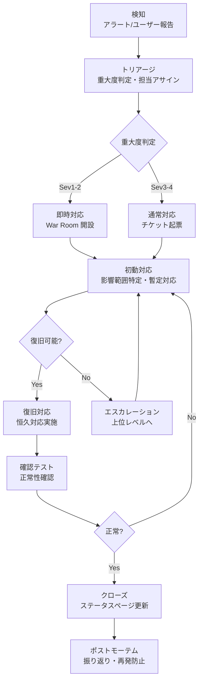

# インシデント対応計画

---

## 目次

1. [インシデント管理方針](#インシデント管理方針)
2. [インシデント分類](#インシデント分類)
3. [対応体制](#対応体制)
4. [インシデント対応フロー](#インシデント対応フロー)
5. [初動対応手順](#初動対応手順)
6. [復旧手順](#復旧手順)
7. [ポストモーテムプロセス](#ポストモーテムプロセス)
8. [定期訓練計画](#定期訓練計画)
9. [関連ドキュメント](#関連ドキュメント)
10. [変更履歴](#変更履歴)

---

## インシデント管理方針

### 目的

本ドキュメントは、システム障害やセキュリティインシデント発生時の対応手順を定義する。
迅速な検知・対応・復旧により、サービス影響を最小化することを目的とする。

### 適用範囲

| 対象 | 説明 |
|------|------|
| 対象システム | {{TARGET_SYSTEMS}} |
| 対象インシデント | サービス障害、パフォーマンス劣化、セキュリティインシデント、データ損失 |
| 対象外 | {{OUT_OF_SCOPE}} |

---

## インシデント分類

### 重大度定義

| 重大度 | 定義 | 例 | 初動対応時間 | 復旧目標時間 |
|--------|------|-----|------------|------------|
| Sev1（Critical） | サービス全面停止、データ損失の恐れ | {{SEV1_EXAMPLE}} | 15分以内 | {{SEV1_RTO}} |
| Sev2（Major） | 主要機能の一部が利用不可 | {{SEV2_EXAMPLE}} | 30分以内 | {{SEV2_RTO}} |
| Sev3（Minor） | パフォーマンス低下、非主要機能の障害 | {{SEV3_EXAMPLE}} | 2時間以内 | {{SEV3_RTO}} |
| Sev4（Low） | 軽微な不具合、ユーザー影響なし | {{SEV4_EXAMPLE}} | 翌営業日 | {{SEV4_RTO}} |

### インシデントカテゴリ

| カテゴリ | 説明 | 主な対応チーム |
|---------|------|-------------|
| インフラ障害 | サーバー、ネットワーク、クラウドサービスの障害 | {{INFRA_TEAM}} |
| アプリケーション障害 | アプリケーションのバグ、クラッシュ | {{APP_TEAM}} |
| セキュリティインシデント | 不正アクセス、情報漏洩、脆弱性悪用 | {{SEC_TEAM}} |
| データ障害 | データ損失、データ不整合、バックアップ失敗 | {{DATA_TEAM}} |
| 外部依存障害 | 外部API、SaaSサービスの障害 | {{EXTERNAL_TEAM}} |

---

## 対応体制

### オンコールローテーション

| ロール | 担当者 | ローテーション | 連絡方法 |
|--------|--------|-------------|---------|
| プライマリオンコール | {{PRIMARY}} | {{ROTATION}} | {{CONTACT}} |
| セカンダリオンコール | {{SECONDARY}} | {{ROTATION}} | {{CONTACT}} |
| エスカレーション先 | {{ESCALATION}} | - | {{CONTACT}} |

### エスカレーションパス

| 経過時間 | 未解決時のアクション | 通知先 |
|---------|-------------------|--------|
| 0分 | インシデント検知、プライマリオンコール通知 | {{PRIMARY}} |
| 15分 | セカンダリオンコール参加 | {{SECONDARY}} |
| 30分 | チームリード通知 | {{TEAM_LEAD}} |
| 1時間 | マネージャー通知 | {{MANAGER}} |
| 2時間 | 経営層通知（Sev1のみ） | {{EXECUTIVE}} |

### コミュニケーション計画

| 対象 | 通知手段 | 更新頻度 | テンプレート |
|------|---------|---------|-----------|
| 社内関係者 | {{INTERNAL_CHANNEL}} | {{INTERNAL_FREQ}} | {{INTERNAL_TEMPLATE}} |
| 顧客 | {{EXTERNAL_CHANNEL}} | {{EXTERNAL_FREQ}} | {{EXTERNAL_TEMPLATE}} |
| ステータスページ | {{STATUS_PAGE_URL}} | {{STATUS_FREQ}} | - |

---

## インシデント対応フロー



---

## 初動対応手順

### 1. 検知確認

| 手順 | 内容 |
|------|------|
| アラート確認 | ダッシュボードでアラート内容を確認 |
| ログ確認 | 該当時間帯のエラーログを確認 |
| 影響確認 | ユーザー影響の有無を確認 |

```bash
# ログ確認コマンド例
{{LOG_CHECK_COMMAND}}
```

### 2. 影響範囲特定

| 確認項目 | 確認方法 |
|---------|---------|
| 影響サービス | {{SERVICE_CHECK}} |
| 影響ユーザー数 | {{USER_IMPACT_CHECK}} |
| データへの影響 | {{DATA_IMPACT_CHECK}} |

### 3. 暫定対応

| パターン | 対応 |
|---------|------|
| 特定エンドポイントの障害 | {{ENDPOINT_WORKAROUND}} |
| リソース枯渇 | {{RESOURCE_WORKAROUND}} |
| 外部依存の障害 | {{EXTERNAL_WORKAROUND}} |

### 4. ステータスページ更新

```
## インシデント報告（初報）
- 発生時刻: {{TIMESTAMP}}
- 影響範囲: {{IMPACT_SCOPE}}
- 現在の状況: {{CURRENT_STATUS}}
- 次回更新予定: {{NEXT_UPDATE}}
```

---

## 復旧手順

### 恒久対応

| 手順 | 内容 |
|------|------|
| 根本原因の特定 | ログ・メトリクス・トレースから原因を特定 |
| 修正の実施 | コード修正、設定変更、インフラ変更 |
| 変更のデプロイ | ホットフィックスまたは通常デプロイ |

### 確認テスト

- [ ] 障害が再現しないことを確認
- [ ] 関連機能が正常に動作することを確認
- [ ] メトリクスが正常値に復帰していることを確認
- [ ] {{ADDITIONAL_VERIFICATION}}

### クローズ判定

| 判定項目 | 基準 |
|---------|------|
| 機能正常性 | 全主要機能が正常に動作 |
| メトリクス正常性 | SLI が SLO 閾値以内に復帰 |
| エラーレート | 障害前と同等レベルに低下 |
| {{CUSTOM_CRITERIA}} | {{CUSTOM_THRESHOLD}} |

---

## ポストモーテムプロセス

### ポストモーテムテンプレート

```markdown
# ポストモーテム: {{INCIDENT_TITLE}}

## 基本情報
- インシデントID: {{INCIDENT_ID}}
- 重大度: {{SEVERITY}}
- 発生日時: {{START_TIME}}
- 復旧日時: {{END_TIME}}
- 影響時間: {{DURATION}}
- インシデントコマンダー: {{COMMANDER}}

## What happened（何が起きたか）
{{WHAT_HAPPENED}}

## Timeline（タイムライン）
| 時刻 | イベント |
|------|---------|
| {{TIME}} | {{EVENT}} |

## Root cause（根本原因）
{{ROOT_CAUSE}}

## Impact（影響）
- 影響ユーザー数: {{AFFECTED_USERS}}
- 影響サービス: {{AFFECTED_SERVICES}}
- SLO への影響: {{SLO_IMPACT}}

## Action items（改善アクション）
| ID | アクション | 担当 | 期限 | 優先度 |
|----|-----------|------|------|--------|
| {{ID}} | {{ACTION}} | {{OWNER}} | {{DEADLINE}} | {{PRIORITY}} |

## Lessons learned（学び）
### うまくいったこと
- {{GOOD_POINT}}

### 改善が必要なこと
- {{IMPROVEMENT_POINT}}
```

### 共有フロー

| タイミング | アクション | 担当 |
|-----------|-----------|------|
| 復旧後 48 時間以内 | ポストモーテムドラフト作成 | インシデントコマンダー |
| 復旧後 1 週間以内 | レビューミーティング実施 | 関係者全員 |
| レビュー後 | Action items のチケット化 | {{TICKET_OWNER}} |
| 月次 | Action items 進捗確認 | {{REVIEW_OWNER}} |

### 再発防止策管理

| 管理方法 | ツール/場所 |
|---------|-----------|
| Action items 追跡 | {{TRACKING_TOOL}} |
| 過去インシデント検索 | {{SEARCH_TOOL}} |
| 統計・傾向分析 | {{ANALYTICS_TOOL}} |

---

## 定期訓練計画

### 訓練頻度

| 訓練種別 | 頻度 | 対象者 |
|---------|------|--------|
| テーブルトップ演習 | {{TABLETOP_FREQ}} | {{TABLETOP_TARGET}} |
| 障害注入テスト（Chaos Engineering） | {{CHAOS_FREQ}} | {{CHAOS_TARGET}} |
| フェイルオーバー訓練 | {{FAILOVER_FREQ}} | {{FAILOVER_TARGET}} |
| オンコール引き継ぎ訓練 | {{ONCALL_FREQ}} | {{ONCALL_TARGET}} |

### 訓練シナリオ例

| シナリオ | 重大度 | 目的 | 評価ポイント |
|---------|--------|------|------------|
| DB プライマリのダウン | Sev1 | フェイルオーバー手順の確認 | 検知時間、復旧時間、データ損失の有無 |
| 外部 API の応答遅延 | Sev2 | サーキットブレーカーの動作確認 | 影響範囲の局所化、ユーザー通知の適切さ |
| メモリリークによる段階的劣化 | Sev3 | 早期検知能力の確認 | 検知までの時間、自動スケーリングの動作 |
| {{CUSTOM_SCENARIO}} | {{SEVERITY}} | {{PURPOSE}} | {{EVALUATION}} |

### 評価基準

| 指標 | 目標 | 計測方法 |
|------|------|---------|
| 検知時間（MTTD） | {{MTTD_TARGET}} | アラート発報から確認までの時間 |
| 対応開始時間（MTTA） | {{MTTA_TARGET}} | 確認から初動対応開始までの時間 |
| 復旧時間（MTTR） | {{MTTR_TARGET}} | 初動対応から復旧完了までの時間 |
| コミュニケーション適切性 | {{COMM_TARGET}} | ステータス更新の頻度と正確性 |

---

## 関連ドキュメント

| ドキュメント | リンク |
|-------------|--------|
| 可観測性設計書 | [observability_design.md](./observability_design.md) |
| 運用手順書 | [operations.md](./operations.md) |
| セキュリティ設計書 | [security.md](../03_architecture/security.md) |
| バックアップ/DR計画 | [backup_restore_dr.md](./backup_restore_dr.md) |

---

## 変更履歴

| 日付 | バージョン | 変更者 | 変更内容 |
|------|-----------|--------|----------|
| {{DATE}} | 1.0.0 | {{AUTHOR}} | 初版作成 |
