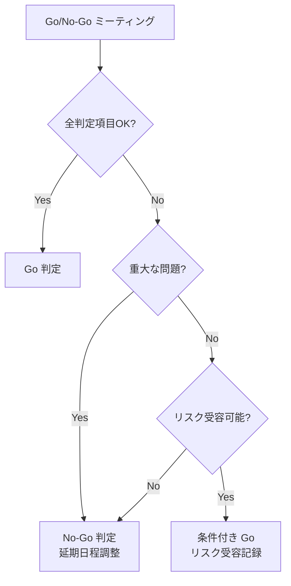

# 移行計画

---

## 目次

1. [移行概要](#移行概要)
2. [移行アプローチ](#移行アプローチ)
3. [移行対象分析](#移行対象分析)
4. [データ移行仕様](#データ移行仕様)
5. [カットオーバー手順](#カットオーバー手順)
6. [Go/No-Go判定基準](#gono-go判定基準)
7. [ロールバック/フォールバック](#ロールバックフォールバック)
8. [移行後検証](#移行後検証)
9. [移行リハーサル計画](#移行リハーサル計画)
10. [関連ドキュメント](#関連ドキュメント)
11. [変更履歴](#変更履歴)

---

## 移行概要

### 目的

{{MIGRATION_PURPOSE}}

### 対象システム

| 項目 | 移行元 | 移行先 |
|------|--------|--------|
| システム名 | {{SOURCE_SYSTEM}} | {{TARGET_SYSTEM}} |
| 技術スタック | {{SOURCE_STACK}} | {{TARGET_STACK}} |
| データベース | {{SOURCE_DB}} | {{TARGET_DB}} |
| ホスティング | {{SOURCE_HOSTING}} | {{TARGET_HOSTING}} |

### 移行方式選定理由

{{MIGRATION_APPROACH_RATIONALE}}

---

## 移行アプローチ

### アプローチ比較

| アプローチ | 概要 | メリット | デメリット | 適用条件 |
|-----------|------|---------|-----------|---------|
| Big Bang | 一括切り替え | 移行期間が短い、並行運用不要 | リスクが高い、ロールバックが困難 | 小規模システム、ダウンタイム許容 |
| 段階的移行 | 機能/サービス単位で順次移行 | リスク分散、段階的検証 | 移行期間が長い、中間状態の管理 | マイクロサービス、機能分離可能 |
| 並行稼働 | 新旧システム同時稼働 | ロールバック容易、比較検証可能 | コスト高、データ同期が必要 | ミッションクリティカル、高可用性要求 |

### 選定アプローチ

| 項目 | 内容 |
|------|------|
| 選定方式 | {{SELECTED_APPROACH}} |
| 選定理由 | {{SELECTION_REASON}} |
| 移行期間 | {{MIGRATION_PERIOD}} |
| 許容ダウンタイム | {{ALLOWED_DOWNTIME}} |

---

## 移行対象分析

### 移行対象一覧

| 対象 | 種別 | 移行方式 | リスク | 優先度 | 備考 |
|------|------|---------|--------|--------|------|
| {{TARGET}} | データ | {{METHOD}} | {{RISK}} | {{PRIORITY}} | {{NOTES}} |
| {{TARGET}} | 機能 | {{METHOD}} | {{RISK}} | {{PRIORITY}} | {{NOTES}} |
| {{TARGET}} | 設定 | {{METHOD}} | {{RISK}} | {{PRIORITY}} | {{NOTES}} |

### 移行対象外

| 対象 | 除外理由 | 代替対応 |
|------|---------|---------|
| {{EXCLUDED_TARGET}} | {{EXCLUSION_REASON}} | {{ALTERNATIVE}} |

---

## データ移行仕様

### データマッピング

| 移行元テーブル | カラム | 移行先エンティティ | フィールド | 変換ルール |
|--------------|--------|-----------------|-----------|-----------|
| {{SOURCE_TABLE}} | {{SOURCE_COLUMN}} | {{TARGET_ENTITY}} | {{TARGET_FIELD}} | {{TRANSFORM_RULE}} |

### 変換ルール詳細

#### 型変換

| 移行元の型 | 移行先の型 | 変換方法 | 注意事項 |
|-----------|-----------|---------|---------|
| {{SOURCE_TYPE}} | {{TARGET_TYPE}} | {{CONVERSION}} | {{NOTES}} |

#### 値マッピング

| フィールド | 移行元の値 | 移行先の値 | 備考 |
|-----------|-----------|-----------|------|
| {{FIELD}} | {{SOURCE_VALUE}} | {{TARGET_VALUE}} | {{NOTES}} |

#### デフォルト値

| フィールド | 条件 | デフォルト値 | 理由 |
|-----------|------|------------|------|
| {{FIELD}} | {{CONDITION}} | {{DEFAULT_VALUE}} | {{REASON}} |

### 整合性制約

#### 参照整合性

| 制約 | 移行元 | 移行先 | 対応方法 |
|------|--------|--------|---------|
| {{CONSTRAINT}} | {{SOURCE_REF}} | {{TARGET_REF}} | {{HANDLING}} |

#### ユニーク制約の扱い

| 制約 | 対象フィールド | 衝突時の対応 |
|------|-------------|------------|
| {{CONSTRAINT}} | {{FIELDS}} | {{CONFLICT_HANDLING}} |

---

## カットオーバー手順

### タイムライン

| 時刻（相対） | 作業 | 担当 | 完了基準 | ロールバック判断点 |
|------------|------|------|---------|----------------|
| T-{{N}}h | 事前準備チェック完了 | {{ASSIGNEE}} | チェックリスト全項目OK | - |
| T-{{N}}h | バックアップ取得 | {{ASSIGNEE}} | バックアップ成功確認 | - |
| T-0 | サービス停止（メンテナンスモード） | {{ASSIGNEE}} | 全トラフィック遮断確認 | - |
| T+{{N}}m | データ移行実行 | {{ASSIGNEE}} | 移行スクリプト正常終了 | {{ROLLBACK_POINT}} |
| T+{{N}}m | データ検証 | {{ASSIGNEE}} | 件数照合・サンプル確認OK | {{ROLLBACK_POINT}} |
| T+{{N}}m | 新システム起動 | {{ASSIGNEE}} | ヘルスチェック正常 | {{ROLLBACK_POINT}} |
| T+{{N}}m | 動作確認 | {{ASSIGNEE}} | 機能テスト全項目OK | {{ROLLBACK_POINT}} |
| T+{{N}}m | DNS切り替え | {{ASSIGNEE}} | トラフィック到達確認 | {{ROLLBACK_POINT}} |
| T+{{N}}h | メンテナンスモード解除 | {{ASSIGNEE}} | ユーザーアクセス確認 | - |
| T+{{N}}h | 監視強化期間開始 | {{ASSIGNEE}} | ダッシュボード確認 | - |

### 事前準備チェックリスト

- [ ] 全移行スクリプトのテスト完了
- [ ] リハーサル実施済み（結果レポート確認）
- [ ] ロールバック手順のテスト完了
- [ ] バックアップの整合性確認
- [ ] 関係者への事前通知完了
- [ ] ステータスページの事前更新
- [ ] {{CUSTOM_PREP_CHECK}}

---

## Go/No-Go判定基準

### 判定項目

| 判定項目 | 基準 | 確認方法 | 判定者 |
|---------|------|---------|--------|
| リハーサル結果 | 直近リハーサルで全項目 OK | リハーサルレポート | {{JUDGE}} |
| データバックアップ | 最新バックアップ取得済み | バックアップログ確認 | {{JUDGE}} |
| ロールバック手順 | テスト済み・手順書最新 | テスト結果レポート | {{JUDGE}} |
| 関係者の準備 | 全担当者が待機可能 | 出欠確認 | {{JUDGE}} |
| 外部依存 | 外部サービスの正常稼働 | ステータスページ確認 | {{JUDGE}} |
| {{CUSTOM_CRITERIA}} | {{CUSTOM_STANDARD}} | {{CUSTOM_METHOD}} | {{JUDGE}} |

### 判定フロー



---

## ロールバック/フォールバック

### ロールバック判定基準

| 条件 | 判定 | 判定者 |
|------|------|--------|
| データ移行の失敗（0件移行、大量エラー） | 即時ロールバック | {{JUDGE}} |
| 主要機能の動作不良 | 30分以内に解決不可ならロールバック | {{JUDGE}} |
| パフォーマンス基準未達 | 1時間以内に改善不可ならロールバック | {{JUDGE}} |
| {{CUSTOM_CONDITION}} | {{CUSTOM_DECISION}} | {{JUDGE}} |

### ロールバック手順

```bash
# Step 1: 新システムの停止
{{NEW_SYSTEM_STOP_COMMAND}}

# Step 2: DNS切り戻し（必要な場合）
{{DNS_ROLLBACK_COMMAND}}

# Step 3: 旧システムの復元
{{OLD_SYSTEM_RESTORE_COMMAND}}

# Step 4: データのリストア（必要な場合）
{{DATA_RESTORE_COMMAND}}

# Step 5: 旧システムの起動
{{OLD_SYSTEM_START_COMMAND}}

# Step 6: 動作確認
{{ROLLBACK_VERIFICATION_COMMAND}}
```

### フォールバック構成

| フェーズ | フォールバック方式 | 切り替え時間 |
|---------|-----------------|------------|
| 移行中 | バックアップからリストア | {{RESTORE_TIME}} |
| 移行直後（並行稼働期間） | 旧システムへのDNS切り戻し | {{DNS_SWITCH_TIME}} |
| 移行完了後（旧システム停止前） | 旧システム再起動 | {{RESTART_TIME}} |
| 旧システム停止後 | バックアップからの再構築 | {{REBUILD_TIME}} |

---

## 移行後検証

### 機能検証チェックリスト

| 機能 | テスト項目 | 期待結果 | 確認者 | 結果 |
|------|-----------|---------|--------|------|
| {{FEATURE}} | {{TEST_ITEM}} | {{EXPECTED}} | {{VERIFIER}} | {{RESULT}} |

### データ整合性検証

#### 件数照合

| テーブル/エンティティ | 移行元件数 | 移行先件数 | 差分 | 差分理由 |
|---------------------|-----------|-----------|------|---------|
| {{ENTITY}} | {{SOURCE_COUNT}} | {{TARGET_COUNT}} | {{DIFF}} | {{REASON}} |

#### サンプリング検証

| テーブル/エンティティ | サンプル数 | 検証項目 | 結果 |
|---------------------|-----------|---------|------|
| {{ENTITY}} | {{SAMPLE_SIZE}} | {{VERIFICATION_ITEMS}} | {{RESULT}} |

#### 業務シナリオ検証

| シナリオ | 手順 | 期待結果 | 確認者 | 結果 |
|---------|------|---------|--------|------|
| {{SCENARIO}} | {{STEPS}} | {{EXPECTED}} | {{VERIFIER}} | {{RESULT}} |

### パフォーマンス検証

| 指標 | 基準値（旧システム） | 測定値（新システム） | 判定 |
|------|-------------------|-------------------|------|
| レスポンスタイム（p50） | {{OLD_P50}} | {{NEW_P50}} | {{VERDICT}} |
| レスポンスタイム（p99） | {{OLD_P99}} | {{NEW_P99}} | {{VERDICT}} |
| スループット | {{OLD_THROUGHPUT}} | {{NEW_THROUGHPUT}} | {{VERDICT}} |
| {{CUSTOM_METRIC}} | {{OLD_VALUE}} | {{NEW_VALUE}} | {{VERDICT}} |

---

## 移行リハーサル計画

### リハーサル概要

| 項目 | 内容 |
|------|------|
| リハーサル回数 | {{REHEARSAL_COUNT}} |
| 環境 | {{REHEARSAL_ENV}} |
| データ | {{REHEARSAL_DATA}} |

### リハーサルスケジュール

| 回 | 予定日 | 目的 | スコープ |
|----|--------|------|---------|
| 第1回 | {{DATE_1}} | 手順確認、タイムライン検証 | {{SCOPE_1}} |
| 第2回 | {{DATE_2}} | 本番同等データでの検証 | {{SCOPE_2}} |
| 最終 | {{DATE_FINAL}} | 総合リハーサル | 全スコープ |

### 評価基準

| 指標 | 合格基準 | 不合格時のアクション |
|------|---------|-------------------|
| 総所要時間 | 許容ダウンタイム以内 | 手順最適化、並列化検討 |
| データ整合性 | 差分 0 件 | 移行スクリプトの修正 |
| ロールバック時間 | 目標 RTO 以内 | ロールバック手順の改善 |
| {{CUSTOM_METRIC}} | {{CUSTOM_CRITERIA}} | {{CUSTOM_ACTION}} |

### リハーサル結果記録

| 回 | 実施日 | 総所要時間 | データ件数 | 問題点 | 対応 |
|----|--------|----------|-----------|--------|------|
| {{ROUND}} | {{DATE}} | {{DURATION}} | {{COUNT}} | {{ISSUES}} | {{ACTIONS}} |

---

## 関連ドキュメント

| ドキュメント | リンク |
|-------------|--------|
| アーキテクチャ設計書 | [architecture.md](../03_architecture/architecture.md) |
| データ構造定義 | [data_structure.md](../04_data_structure/data_structure.md) |
| 運用手順書 | [operations.md](./operations.md) |
| バックアップ/DR計画 | [backup_restore_dr.md](./backup_restore_dr.md) |
| 既存システム分析 | [gap_analysis.md](../00_analysis/gap_analysis.md) |

---

## 変更履歴

| 日付 | バージョン | 変更者 | 変更内容 |
|------|-----------|--------|----------|
| {{DATE}} | 1.0.0 | {{AUTHOR}} | 初版作成 |
