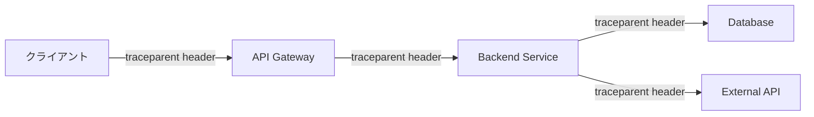

# 可観測性設計書

---

## 目次

1. [可観測性方針](#可観測性方針)
2. [SLI/SLO定義](#slislo定義)
3. [メトリクス設計](#メトリクス設計)
4. [ログ設計](#ログ設計)
5. [分散トレーシング](#分散トレーシング)
6. [ダッシュボード設計](#ダッシュボード設計)
7. [アラート設計](#アラート設計)
8. [関連ドキュメント](#関連ドキュメント)
9. [変更履歴](#変更履歴)

---

## 可観測性方針

### 目的

本ドキュメントは、システムの可観測性（Observability）に関する設計を定義する。
メトリクス・ログ・トレースの 3 本柱により、システムの内部状態を外部から把握可能にする。

### 関連NFR/ADR

| ID | 概要 | 関連箇所 |
|----|------|---------|
| {{NFR_ID}} | {{NFR_SUMMARY}} | {{SECTION}} |
| {{ADR_ID}} | {{ADR_SUMMARY}} | {{SECTION}} |

### 技術スタック

| 領域 | ツール/サービス | 用途 |
|------|---------------|------|
| メトリクス収集 | {{METRICS_TOOL}} | {{PURPOSE}} |
| ログ集約 | {{LOG_TOOL}} | {{PURPOSE}} |
| トレーシング | {{TRACING_TOOL}} | {{PURPOSE}} |
| ダッシュボード | {{DASHBOARD_TOOL}} | {{PURPOSE}} |
| アラート通知 | {{ALERT_TOOL}} | {{PURPOSE}} |

---

## SLI/SLO定義

### SLI/SLO一覧

| サービス | SLI | SLO | 測定方法 | 計算式 | アラート閾値 | エスカレーション |
|---------|-----|-----|---------|--------|------------|--------------|
| {{SERVICE}} | {{SLI}} | {{SLO}} | {{MEASUREMENT}} | {{FORMULA}} | {{ALERT_THRESHOLD}} | {{ESCALATION}} |

### エラーバジェット

| サービス | SLO | 月間エラーバジェット | 消費率アラート |
|---------|-----|-------------------|-------------|
| {{SERVICE}} | {{SLO}} | {{ERROR_BUDGET}} | {{BURN_RATE_ALERT}} |

### SLO違反時の対応

| 消費率 | 対応 |
|--------|------|
| 50% 以上 | {{ACTION_50}} |
| 75% 以上 | {{ACTION_75}} |
| 100% | {{ACTION_100}} |

---

## メトリクス設計

### システムメトリクス

| メトリクス | 収集元 | 収集間隔 | 単位 | アラート閾値 |
|-----------|--------|---------|------|------------|
| CPU使用率 | {{SOURCE}} | {{INTERVAL}} | % | {{THRESHOLD}} |
| メモリ使用率 | {{SOURCE}} | {{INTERVAL}} | % | {{THRESHOLD}} |
| ディスク使用率 | {{SOURCE}} | {{INTERVAL}} | % | {{THRESHOLD}} |
| ネットワークI/O | {{SOURCE}} | {{INTERVAL}} | bytes/sec | {{THRESHOLD}} |

### アプリケーションメトリクス（REDメソッド）

| メトリクス | 説明 | 収集方法 | 単位 | アラート閾値 |
|-----------|------|---------|------|------------|
| Rate（リクエストレート） | 単位時間あたりのリクエスト数 | {{METHOD}} | req/sec | {{THRESHOLD}} |
| Error（エラーレート） | エラーレスポンスの割合 | {{METHOD}} | % | {{THRESHOLD}} |
| Duration（レイテンシ） | レスポンス時間（p50/p90/p99） | {{METHOD}} | ms | {{THRESHOLD}} |

### ビジネスメトリクス

| メトリクス | 説明 | 収集方法 | 単位 | 期待値 |
|-----------|------|---------|------|--------|
| {{BUSINESS_METRIC}} | {{DESCRIPTION}} | {{METHOD}} | {{UNIT}} | {{EXPECTED}} |

### メトリクス命名規則

```
{{NAMING_CONVENTION}}
```

例:
- `{{METRIC_EXAMPLE_1}}`
- `{{METRIC_EXAMPLE_2}}`

---

## ログ設計

### ログレベル定義

| レベル | 使用基準 | 例 |
|--------|---------|-----|
| ERROR | システム機能に影響する異常。即時対応が必要 | DB接続失敗、外部API障害、データ不整合 |
| WARN | 潜在的な問題。監視対象だが即時対応は不要 | レート制限接近、非推奨API使用、リトライ発生 |
| INFO | 正常な業務イベント。運用監視の基本情報 | リクエスト処理完了、ジョブ実行結果、認証成功 |
| DEBUG | 開発・調査用の詳細情報。本番では通常無効 | SQLクエリ詳細、変数値、処理ステップ |

### 構造化ログフォーマット

```json
{
  "timestamp": "{{TIMESTAMP_FORMAT}}",
  "level": "INFO",
  "service": "{{SERVICE_NAME}}",
  "trace_id": "{{TRACE_ID}}",
  "span_id": "{{SPAN_ID}}",
  "message": "{{MESSAGE}}",
  "context": {
    "user_id": "{{USER_ID}}",
    "request_id": "{{REQUEST_ID}}",
    "method": "{{HTTP_METHOD}}",
    "path": "{{REQUEST_PATH}}",
    "status": {{STATUS_CODE}},
    "duration_ms": {{DURATION}}
  },
  "error": {
    "type": "{{ERROR_TYPE}}",
    "message": "{{ERROR_MESSAGE}}",
    "stack": "{{STACK_TRACE}}"
  }
}
```

### ログ保持ポリシー

| ログ種別 | 保持期間 | 保存先 | 圧縮 |
|---------|---------|--------|------|
| アプリケーションログ | {{RETENTION}} | {{STORAGE}} | {{COMPRESSION}} |
| アクセスログ | {{RETENTION}} | {{STORAGE}} | {{COMPRESSION}} |
| 監査ログ | {{RETENTION}} | {{STORAGE}} | {{COMPRESSION}} |
| エラーログ | {{RETENTION}} | {{STORAGE}} | {{COMPRESSION}} |

### PIIマスキングルール

| マスク対象フィールド | マスク方法 | マスク後の例 |
|-------------------|-----------|------------|
| メールアドレス | 部分マスク | `u***@example.com` |
| 電話番号 | 末尾4桁以外マスク | `***-****-1234` |
| クレジットカード番号 | 末尾4桁以外マスク | `****-****-****-5678` |
| パスワード | 完全マスク | `[REDACTED]` |
| {{CUSTOM_PII_FIELD}} | {{MASK_METHOD}} | {{MASK_EXAMPLE}} |

---

## 分散トレーシング

### トレーシング方針

| 項目 | 内容 |
|------|------|
| 伝播形式 | W3C Trace Context |
| サンプリング戦略 | {{SAMPLING_STRATEGY}} |
| サンプリングレート | {{SAMPLING_RATE}} |

### トレースID伝播



### サンプリング戦略

| 条件 | サンプリングレート | 理由 |
|------|-----------------|------|
| エラーレスポンス | 100% | 障害調査に必須 |
| 高レイテンシ（> {{LATENCY_THRESHOLD}}ms） | 100% | パフォーマンス調査に必須 |
| 通常リクエスト | {{NORMAL_RATE}} | コスト最適化 |
| ヘルスチェック | 0% | ノイズ除去 |

### スパン属性

| 属性 | 説明 | 例 |
|------|------|-----|
| `service.name` | サービス名 | `{{SERVICE_NAME}}` |
| `http.method` | HTTPメソッド | `GET`, `POST` |
| `http.status_code` | ステータスコード | `200`, `500` |
| `db.system` | DB種別 | `postgresql` |
| `{{CUSTOM_ATTRIBUTE}}` | {{DESCRIPTION}} | {{EXAMPLE}} |

---

## ダッシュボード設計

### 概要ダッシュボード

全体の健全性を一目で把握するためのダッシュボード。

| パネル | 表示内容 | データソース |
|--------|---------|------------|
| SLO ステータス | 各サービスの SLO 達成状況 | {{DATA_SOURCE}} |
| エラーレート | 直近1時間のエラー推移 | {{DATA_SOURCE}} |
| レスポンスタイム | p50/p90/p99 の推移 | {{DATA_SOURCE}} |
| アクティブアラート | 未解決アラート一覧 | {{DATA_SOURCE}} |

### サービス別ダッシュボード

| パネル | 表示内容 | データソース |
|--------|---------|------------|
| REDメトリクス | Rate/Error/Duration | {{DATA_SOURCE}} |
| リソース使用率 | CPU/メモリ/ディスク | {{DATA_SOURCE}} |
| インスタンス状態 | 各インスタンスの状態 | {{DATA_SOURCE}} |
| 依存サービス状態 | 外部依存の応答状況 | {{DATA_SOURCE}} |

### ビジネスダッシュボード

| パネル | 表示内容 | データソース |
|--------|---------|------------|
| {{BUSINESS_PANEL}} | {{CONTENT}} | {{DATA_SOURCE}} |

---

## アラート設計

### アラート一覧

| アラート名 | 条件 | 重大度 | 通知先 | 対応手順リンク |
|-----------|------|--------|--------|-------------|
| {{ALERT_NAME}} | {{CONDITION}} | {{SEVERITY}} | {{NOTIFICATION_TARGET}} | {{RUNBOOK_LINK}} |

### 重大度定義

| 重大度 | 定義 | 通知方法 | 対応時間 |
|--------|------|---------|---------|
| Critical | サービスダウンまたはデータ損失の恐れ | {{CRITICAL_NOTIFY}} | 即時 |
| Warning | パフォーマンス低下または部分的な機能障害 | {{WARNING_NOTIFY}} | 1時間以内 |
| Info | 注意が必要だが即時対応は不要 | {{INFO_NOTIFY}} | 翌営業日 |

### アラート運用ルール

#### アラート疲れ防止

| ルール | 内容 |
|--------|------|
| 集約 | 同一原因のアラートは {{AGGREGATION_WINDOW}} 以内に集約 |
| デバウンス | 閾値超過が {{DEBOUNCE_DURATION}} 継続した場合のみ発報 |
| 自動解決 | 閾値を下回った場合は {{AUTO_RESOLVE_DURATION}} 後に自動解決 |

#### 抑制ルール

| 条件 | 抑制対象 | 理由 |
|------|---------|------|
| 計画メンテナンス中 | 全アラート（Critical除く） | 誤報防止 |
| {{SUPPRESS_CONDITION}} | {{SUPPRESS_TARGET}} | {{SUPPRESS_REASON}} |

#### 静音時間（Silence Window）

| 時間帯 | 対象 | 理由 |
|--------|------|------|
| {{SILENCE_WINDOW}} | {{SILENCE_TARGET}} | {{SILENCE_REASON}} |

---

## 関連ドキュメント

| ドキュメント | リンク |
|-------------|--------|
| インフラストラクチャ設計書 | [infrastructure.md](../03_architecture/infrastructure.md) |
| セキュリティ設計書 | [security.md](../03_architecture/security.md) |
| 運用手順書 | [operations.md](./operations.md) |
| インシデント対応計画 | [incident_response.md](./incident_response.md) |

---

## 変更履歴

| 日付 | バージョン | 変更者 | 変更内容 |
|------|-----------|--------|----------|
| {{DATE}} | 1.0.0 | {{AUTHOR}} | 初版作成 |
