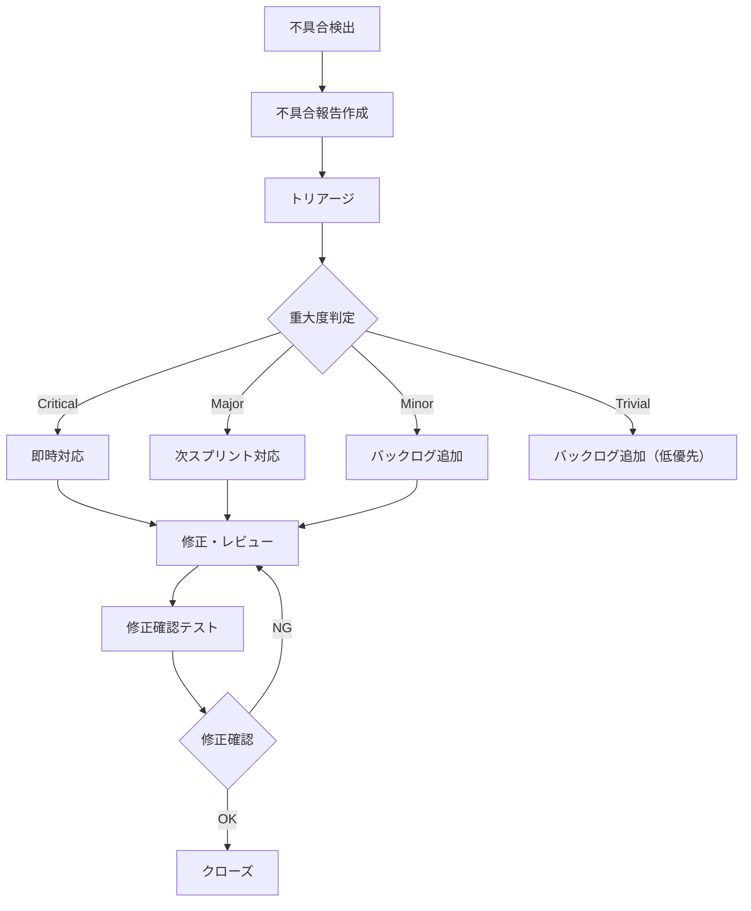

# テスト計画書

---

## 目次

1. [テスト計画概要](#テスト計画概要)
2. [テストスケジュール](#テストスケジュール)
3. [テスト体制](#テスト体制)
4. [テスト環境](#テスト環境)
5. [テスト実施計画](#テスト実施計画)
6. [不具合管理](#不具合管理)
7. [テスト完了基準](#テスト完了基準)
8. [リスクと対策](#リスクと対策)
9. [関連ドキュメント](#関連ドキュメント)
10. [変更履歴](#変更履歴)

---

## テスト計画概要

### 識別子

| 項目 | 内容 |
|------|------|
| 計画ID | TP-{{PROJECT_ID}}-001 |
| プロジェクト名 | {{PROJECT_NAME}} |
| 作成日 | {{CREATED_AT}} |
| 最終更新日 | {{UPDATED_AT}} |

### 目的

本テスト計画書は、{{PROJECT_NAME}} の品質保証活動全体を計画し、
テストプロセスの実行方針・体制・スケジュール・基準を定義する。

### 範囲

#### テスト対象

| 対象 | 説明 |
|------|------|
| {{TEST_TARGET_1}} | {{TARGET_DESC_1}} |
| {{TEST_TARGET_2}} | {{TARGET_DESC_2}} |

#### テスト対象外

| 対象 | 除外理由 |
|------|----------|
| {{EXCLUDED_TARGET_1}} | {{EXCLUSION_REASON_1}} |

### 参照ドキュメント

| ドキュメント | バージョン |
|-------------|-----------|
| 要件定義書（user-stories.md） | {{REQ_VERSION}} |
| アーキテクチャ設計書 | {{ARCH_VERSION}} |
| テスト戦略書 | {{STRATEGY_VERSION}} |

---

## テストスケジュール

### フェーズ別タイムライン

| フェーズ | 開始日 | 終了日 | テスト種別 | 備考 |
|---------|--------|--------|-----------|------|
| テスト準備 | {{PREP_START}} | {{PREP_END}} | - | 環境構築・テストデータ準備 |
| 単体テスト | {{UNIT_START}} | {{UNIT_END}} | 単体テスト | 開発と並行実施 |
| 結合テスト | {{INT_START}} | {{INT_END}} | 結合テスト | API 統合後 |
| システムテスト | {{SYS_START}} | {{SYS_END}} | E2E テスト | ステージング環境 |
| 受入テスト | {{UAT_START}} | {{UAT_END}} | 受入テスト | PO 参加 |
| リグレッションテスト | {{REG_START}} | {{REG_END}} | 回帰テスト | リリース前 |

### マイルストーン

| マイルストーン | 予定日 | 判定基準 |
|--------------|--------|----------|
| テスト準備完了 | {{PREP_COMPLETE}} | 環境構築完了、テストデータ投入完了 |
| 単体テスト完了 | {{UNIT_COMPLETE}} | カバレッジ目標達成 |
| 結合テスト完了 | {{INT_COMPLETE}} | 主要パス全 PASS |
| システムテスト完了 | {{SYS_COMPLETE}} | 主要シナリオ全 PASS |
| 受入テスト完了 | {{UAT_COMPLETE}} | PO 承認 |
| リリース判定 | {{RELEASE_DECISION}} | 全完了基準充足 |

---

## テスト体制

### 役割と責任

| 役割 | 担当者 | 責任 |
|------|--------|------|
| テストマネージャー | {{TEST_MANAGER}} | テスト計画の策定・進捗管理・リリース判定 |
| テストリード | {{TEST_LEAD}} | テストケース設計・レビュー・品質分析 |
| テスト実行者 | {{TEST_EXECUTOR}} | テスト実行・不具合報告 |
| 自動化エンジニア | {{AUTOMATION_ENGINEER}} | テスト自動化・CI/CD 統合 |
| 開発者 | {{DEVELOPER}} | 単体テスト・結合テスト・不具合修正 |
| PO | {{PRODUCT_OWNER}} | 受入テスト・リリース承認 |

### 必要スキル・リソース

| スキル | 必要人数 | 備考 |
|--------|----------|------|
| {{SKILL_1}} | {{COUNT_1}} | {{SKILL_NOTE_1}} |
| {{SKILL_2}} | {{COUNT_2}} | {{SKILL_NOTE_2}} |

---

## テスト環境

### 環境構成

| 環境名 | 用途 | URL | 備考 |
|--------|------|-----|------|
| 開発環境 | 単体・結合テスト | {{DEV_URL}} | 開発者個人環境 |
| CI 環境 | 自動テスト | {{CI_URL}} | GitHub Actions / {{CI_TOOL}} |
| ステージング環境 | E2E・システムテスト | {{STAGING_URL}} | 本番同等構成 |
| 本番同等環境 | 受入・パフォーマンステスト | {{PROD_LIKE_URL}} | 本番データ規模 |

### 環境構築手順

```bash
# 1. リポジトリクローン
{{CLONE_COMMAND}}

# 2. 依存パッケージインストール
{{INSTALL_COMMAND}}

# 3. テスト用データベースセットアップ
{{DB_SETUP_COMMAND}}

# 4. テストデータ投入
{{SEED_COMMAND}}

# 5. テスト実行
{{TEST_COMMAND}}
```

### テストデータ準備

| データ種別 | 準備方法 | 更新頻度 |
|-----------|----------|----------|
| マスターデータ | シードスクリプト | テストサイクル毎 |
| テストユーザー | ファクトリー関数 | テスト実行毎に自動生成 |
| 境界値データ | フィクスチャファイル | 固定 |
| 大量データ | データ生成スクリプト | パフォーマンステスト時 |

---

## テスト実施計画

### テストサイクル

| サイクル | 目的 | 対象テスト | 期間 |
|---------|------|-----------|------|
| α テスト | 主要機能の動作確認 | 単体 + 結合 | {{ALPHA_PERIOD}} |
| β テスト | 統合動作・ユーザーフロー確認 | E2E + 受入 | {{BETA_PERIOD}} |
| RC テスト | リリース候補の最終検証 | 全テスト（回帰含む） | {{RC_PERIOD}} |

### 実施手順

#### α テスト

1. 単体テストを全件実行する
2. カバレッジレポートを生成・確認する
3. 結合テストを主要パスから実行する
4. 不具合を報告・修正する
5. α テスト完了判定を実施する

#### β テスト

1. ステージング環境にデプロイする
2. E2E テストを主要シナリオから実行する
3. PO による受入テストを実施する
4. 不具合を報告・修正する
5. β テスト完了判定を実施する

#### RC テスト

1. 全自動テストを実行する（回帰テスト含む）
2. パフォーマンステストを実行する
3. セキュリティテストを実行する
4. 未解決不具合の最終トリアージを実施する
5. リリース判定会議を開催する

---

## 不具合管理

### 重大度定義

| 重大度 | 定義 | 例 | 対応SLA |
|--------|------|-----|---------|
| Critical | システム全体が利用不可、データ損失が発生 | サーバーダウン、データ破壊 | {{CRITICAL_SLA}} |
| Major | 主要機能が利用不可、回避策なし | ログイン不可、決済失敗 | {{MAJOR_SLA}} |
| Minor | 機能に制限あるが回避策あり | 表示崩れ、ソート不具合 | {{MINOR_SLA}} |
| Trivial | 軽微な不便、表示上の問題 | 誤字、配色ずれ | {{TRIVIAL_SLA}} |

### 不具合対応フロー



### 不具合報告テンプレート

```markdown
## 不具合報告

| 項目 | 内容 |
|------|------|
| 不具合ID | BUG-{{ID}} |
| タイトル | {{TITLE}} |
| 重大度 | {{SEVERITY}} |
| 発見日 | {{FOUND_DATE}} |
| 発見者 | {{REPORTER}} |
| 担当者 | {{ASSIGNEE}} |
| ステータス | {{STATUS}} |
| 関連FR | {{FR_ID}} |

### 再現手順
1. {{STEP_1}}
2. {{STEP_2}}
3. {{STEP_3}}

### 期待結果
{{EXPECTED}}

### 実際の結果
{{ACTUAL}}

### 環境
{{ENVIRONMENT}}

### スクリーンショット・ログ
{{EVIDENCE}}
```

---

## テスト完了基準

### 入口基準（Entry Criteria）

| テストフェーズ | 入口基準 |
|--------------|----------|
| 単体テスト | コーディング完了、ビルド成功、型エラーゼロ |
| 結合テスト | 単体テスト完了（カバレッジ目標達成）、API 実装完了 |
| E2E テスト | 結合テスト完了、ステージング環境構築完了 |
| 受入テスト | E2E テスト完了、全機能実装完了 |
| リリース判定 | 全テストフェーズ完了、未解決 Critical/Major = 0 |

### 出口基準（Exit Criteria）

| テストフェーズ | 出口基準 |
|--------------|----------|
| 単体テスト | カバレッジ目標達成、全テスト PASS |
| 結合テスト | 主要パス全 PASS、Critical 不具合ゼロ |
| E2E テスト | 主要シナリオ全 PASS、Critical/Major 不具合ゼロ |
| 受入テスト | 全 SC 検証完了、PO 承認取得 |
| リリース判定 | 全出口基準充足、リリース判定会議承認 |

---

## リスクと対策

| リスク | 影響 | 発生確率 | 対策 |
|--------|------|----------|------|
| テストスケジュール遅延 | リリース遅延 | 中 | リスクベースで優先順位を設定し、高リスク機能から実施 |
| テスト環境不備 | テスト実行不可 | 低 | 環境構築手順書の事前整備、IaC による自動構築 |
| テスト人員不足 | テスト品質低下 | 中 | 自動化率向上、開発者によるテスト実施 |
| 要件変更 | テストケース修正 | 高 | トレーサビリティマトリクスで影響範囲を迅速に特定 |
| テストデータ不足 | テスト網羅性低下 | 低 | データ生成スクリプトの事前準備 |
| 外部サービス障害 | 結合テスト不可 | 中 | モックサーバーで代替、サービス仮想化 |

---

## 関連ドキュメント

| ドキュメント | リンク |
|-------------|--------|
| テスト戦略書 | [test_strategy.md](./test_strategy.md) |
| トレーサビリティマトリクス | [traceability_matrix.md](./traceability_matrix.md) |
| 非機能テスト計画書 | [nonfunctional_test_plan.md](./nonfunctional_test_plan.md) |
| 要件一覧 | [user-stories.md](../../docs/requirements/user-stories.md) |
| アーキテクチャ設計書 | [architecture.md](../../docs/03_architecture/architecture.md) |
| API設計書 | [api_design.md](../../docs/05_api_design/api_design.md) |
| コーディング規約 | [coding_standards.md](./coding_standards.md) |

---

## 変更履歴

| 日付 | バージョン | 変更者 | 変更内容 |
|------|-----------|--------|----------|
| {{DATE}} | 1.0.0 | {{AUTHOR}} | 初版作成 |
